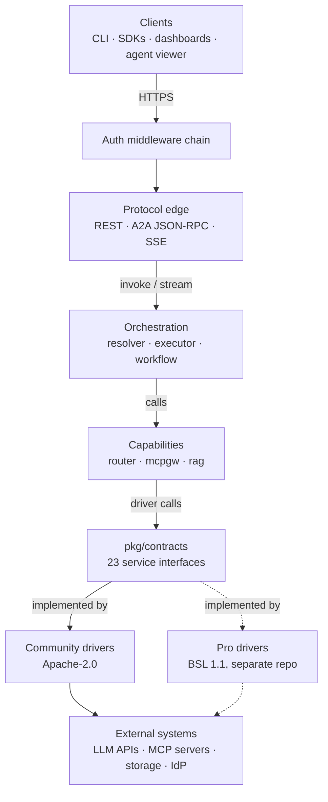
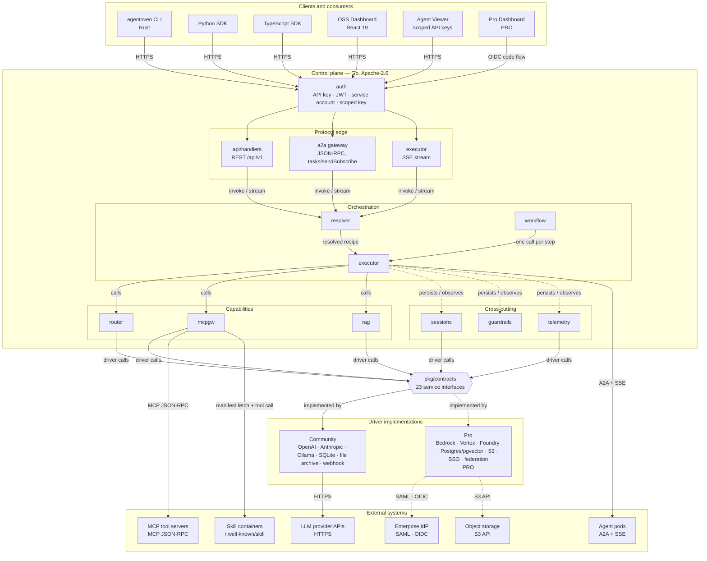
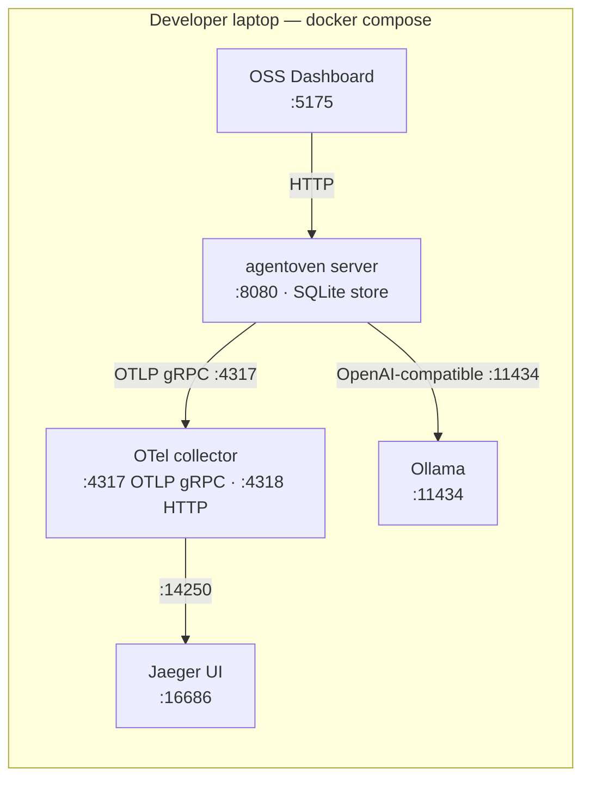
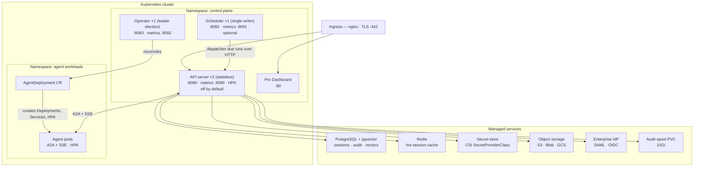

# AgentOven architecture

Scope: the AgentOven control plane, its clients, the `pkg/contracts` service
interfaces, and the deployment topologies it runs in. Components marked
**Pro** live in the separate `agentoven-pro` repository under BSL 1.1 and are
not part of this Apache-2.0 distribution — see [ADR-0003](../ADR/0003-open-core-two-repo-model.md)
for why the split is two repositories rather than build tags.

Diagrams are Mermaid so they diff in a merge request. Update them in the same
commit as the code they describe.

## Simplified architecture

## Component diagram

## Component legend

Editions follow the GitLab convention: the diagram is drawn once, and the table
below — not a colour in the picture — records which distribution ships each
component. Features move between editions; a table survives that, a colour
does not.

| Component | Package / repo | Edition | Responsibility |
|---|---|---|---|
| agentoven CLI | `crates/agentoven-cli` | Community | Local development, agent packaging, invocation |
| Python SDK | `sdk/python` | Community | Blocking `reqwest`-backed client ([ADR-0006](../ADR/0006-python-sdk-reqwest-blocking.md)) |
| TypeScript SDK | `sdk/typescript` | Community | Browser and Node client |
| OSS Dashboard | `control-plane/dashboard` | Community | Agent CRUD, recipes, providers, traces. No auth; local dev tool |
| Agent Viewer | `control-plane/viewer` | Community | Consumer-facing run UI behind scoped API keys ([ADR-0008](../ADR/0008-three-layer-product-architecture.md)) |
| Pro Dashboard | `agentoven-pro/dashboard` | **Pro** | Admin console behind SSO/OIDC with RBAC and audit views |
| Auth chain | `internal/auth` | Community | Pluggable provider chain ([ADR-0002](../ADR/0002-pluggable-auth-provider-chain.md)) |
| REST API | `internal/api` | Community | `/api/v1` — agents, recipes, runs, skills |
| A2A gateway | `crates/a2a-ao`, `internal/api` | Community | Agent-to-agent JSON-RPC ([ADR-0007](../ADR/0007-control-plane-as-a2a-gateway.md)) |
| Resolver | `internal/resolver` | Community | Resolves ingredients, skills and credentials for a run |
| Executor | `internal/executor` | Community | `ExecuteStream` loop, tool dispatch, SSE chunks |
| Workflow engine | `internal/workflow` | Community | Recipe DAG, one executor call per step |
| Model router | `internal/router` | Community | Fallback strategy. All four strategies are **Pro** |
| MCP gateway | `internal/mcpgw` | Community | MCP tool and skill invocation |
| RAG | `internal/rag`, `internal/vectorstore` | Community | Pipelines, chunking, retrieval ([ADR-0020](../ADR/0020-pageindex-vectorless-rag-strategy.md)) |
| Sessions | `internal/sessions`, `internal/ctxwindow` | Community | History and context-window compaction |
| Guardrails | `internal/guardrails` | Community | Structure checks. Injection detection and LLM judge are **Pro** |
| Telemetry | `internal/telemetry` | Community | OTel traces and metrics ([ADR-0019](../ADR/0019-otel-metrics-pipeline-multi-sink.md)) |
| Retention | `internal/retention` | Community | 7-day trace retention. 90–400 days is **Pro** |
| Scheduler | `agentoven-pro/cmd/scheduler` | **Pro** | Standalone single-writer dispatcher |
| Operator | `agentoven-pro/cmd/operator` | **Pro** | Owns the `AgentDeployment` CRD |
| Federation | `agentoven-pro/internal/federation` | **Pro** | Cross-org agent collaboration |

## The contracts seam

Pro never forks this repository. It imports the OSS `Server`, then registers
drivers and overrides against the interfaces in `control-plane/pkg/contracts`.
Adding an interface here is the only supported way to make a subsystem
swappable.

`pkg/contracts` declares 23 interfaces (21 in `contracts.go`, 2 in `auth.go`).
`ProviderDriver` is the exception: it is declared in `internal/router` and
re-exported as a type alias —
`type ProviderDriver = router.ProviderDriver` — because the router owns the
type. Downstream code must name `contracts.ProviderDriver`; Go's `internal/`
rule makes `internal/router` unimportable from another module.

| Interface | Community implementation | Pro implementation |
|---|---|---|
| `ProviderDriver` | OpenAI, Anthropic, Ollama | Bedrock, Vertex, AI Foundry |
| `EmbeddingDriver` | provider-native embeddings | enterprise provider embeddings |
| `VectorStoreDriver` | local vector store | Postgres + pgvector, HNSW |
| `SessionStore` | SQLite | Postgres, Redis hot cache |
| `AuthProvider` / `AuthProviderChain` | API key, service account | SSO/SAML, OIDC, fine-grained RBAC |
| `PlanResolver` / `TierEnforcer` | static community limits | JWT license, per-kitchen quotas |
| `ArchiveDriver` | local file archive | S3, Azure Blob, GCS |
| `ChannelDriver` / `NotificationService` | webhook | Slack, Teams |
| `ChatGatewayDriver` | — | Telegram, Discord, Slack |
| `GuardrailService` | structure checks | injection detection, LLM judge |
| `PromptValidatorService` | structure checks | injection detection, LLM judge |
| `TestRunnerBackend` | local runner ([ADR-0011](../ADR/0011-oss-local-test-runner.md)) | scenario environments, RBAC/ABAC |
| `TrackerDriver` | — | traceability matrix for external agents |
| `DataConnectorDriver` | — | enterprise data connectors |
| `EnvironmentService` | — | scenario and world-state environments |
| `ServiceAccountManager` | HMAC service accounts | managed accounts with revocation |
| `AgentProcessExecutor` | local process | Kubernetes agent pods |
| `ModelRouterService` | fallback only | all four strategies plus custom |
| `MCPGatewayService` | shared | per-agent gateway policy |
| `WorkflowService` | shared | — |
| `RAGService` | shared | provider-agnostic pipelines, PageIndex |

Rows above group related interfaces (`AuthProvider` with `AuthProviderChain`,
`ChannelDriver` with `NotificationService`, `PlanResolver` with
`TierEnforcer`), so the table is shorter than the interface count. A dash means
no implementation ships in that edition.

## Deployment — local development

One binary, one SQLite file, no external dependencies. `install.sh` and the
Homebrew tap ship the same binary; release images are published to
`ghcr.io/agentoven/*` by the GitHub Actions pipeline.

## Deployment — Kubernetes (Pro)

Three Helm charts, deployed and scaled independently
([ADR-0018 in agentoven-pro](https://github.com/agentoven/agentoven-pro)).

### Ports

| Component | Service port | Health | Metrics |
|---|---|---|---|
| API server | 8080 | `/healthz` :8080 | 9090 |
| Scheduler | — | `/health` :8082 | 9091 |
| Operator | — | `/healthz` :8083 | 9092 |
| Pro Dashboard | 80 | — | — |
| OTel collector | 4317 gRPC, 4318 HTTP | — | 8888 self, 8889 scrape |
| Jaeger | 16686 UI, 14268, 14250 | — | — |

### Scaling and failure notes

- **API server is stateless** and scales horizontally. Autoscaling is off by
  default; turn on the HPA per environment.
- **Scheduler is deliberately a single writer** — `replicaCount: 1`, hardcoded
  in the chart template. Set `enabled: false` when an external scheduler
  (Azure Functions, Airflow) drives the tick instead.
- **Operator runs one replica with leader election** and holds a ClusterRole
  over Deployments, Services and HPAs in the agent namespace.
- **Secrets are never in values files.** They are mounted through a CSI
  `SecretProviderClass`; the cluster's own manifests hold the vault
  coordinates.

## Keeping this current

This document is the architecture of record. When you change a package
boundary, add an interface to `pkg/contracts`, or change a deployment topology,
update the matching diagram and table in the same merge request, and add an ADR
under `ADR/` if the change is a decision rather than a refactor.
