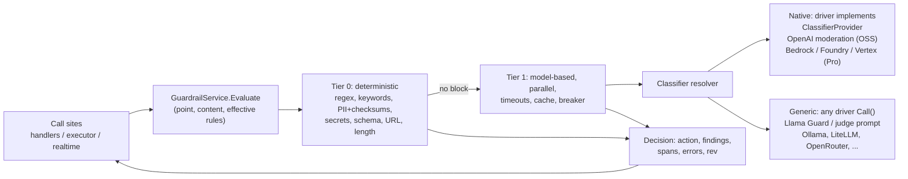

# Guardrails redesign proposal

- **Status:** Proposal, for review (no code changed)
- **Date:** 2026-10-06
- **Scope:** `control-plane/internal/guardrails`, `pkg/contracts.GuardrailService`, `pkg/models` guardrail types, every
  call site in `control-plane/internal/{api/handlers,executor}`, and the Pro realtime handler and workspace-policy code
  in `agentoven-pro`.
- **Hard constraints (from the requester):** no sidecar (must run in-process or as plain HTTP calls, on Kubernetes,
  Lambda, Azure Functions, Cloud Run); follow the provider-driver pattern (capabilities are optional interfaces on
  drivers); minimal and maintainable, no parallel machinery; OSS community implementation, Pro adds enterprise features.

Conventions: `file:line` references were read in this working tree; "verified" means verified by reading code, not by
running it. Anything not verified is marked **(unverified)**. Sections 1 to 2 are findings, 3 to 5 are the proposal.

## 0. Summary of decisions

| # | Decision |
|---|----------|
| 1 | Keep the single `GuardrailService` seam and the `Guardrail` JSON shape. Add one entry point, `Evaluate(ctx, Request)`, with a typed **point** (where in the run) instead of the two-valued input/output stage. `EvaluateInput/Output` stay as wrappers. |
| 2 | Two evaluator tiers, one mechanism each. **Deterministic** evaluators are a small in-process map inside `internal/guardrails` (no credentials, no network). **Model-based** checks reach a classifier or judge through a normal AgentOven provider, via ONE new optional driver interface (`ClassifierProvider`, same pattern as `audio.EngineProvider`) plus a generic chat-model fallback that works on every existing driver. |
| 3 | Seven coverage points: `input`, `retrieval`, `tool_call`, `tool_result`, `delegation`, `output`, `memory_write`, plus transport variants for streaming and realtime. Each has a stated guarantee: prevent, or detect-and-stop. |
| 4 | Actions: `block`, `redact`, `warn`, `approve` (reuses the existing HITL gate), `log`. Plus a per-rule `mode: shadow` for rollout. No LLM "rewrite" action. |
| 5 | Failure policy is per rule (`on_error`), default fail-closed for model-based rules and for mandatory workspace rules, with per-rule timeouts, a stage budget, parallel model checks, a verdict cache and a circuit breaker. |
| 6 | Governance: one `ResolveEffective(workspace, agent, env, exceptions)` function (replacing three ad-hoc merges, one of which is never called), a content-hash `rev` per rule, write-time validation, per-rule test cases run without invoking an agent. |
| 7 | Do not embed Python frameworks (NeMo, Guardrails AI, LLM Guard, Presidio): they would need a sidecar. Borrow their taxonomy; integrate their models and cloud APIs through providers. |
| 8 | Honest framing: classifiers are probabilistic and break under adaptive attack. Real bounds on impact come from deterministic controls (tool allowlists, argument schemas, approvals, egress limits). Guardrails are the detection and policy layer on top. |
| 9 | Phase 1 is a coverage-and-inertness fix with **no new concepts**: one gate helper called from every path, effective-policy resolution that is actually wired, output checked before it is emitted. Model providers come in phase 2. |

## 1. The current system (verified)

### 1.1 Anatomy

- **Model** (`pkg/models/models.go:2479-2570`): `Guardrail{ID, Name, Kind, Stage, Config, Enabled, Overridable,
  Priority, CreatedAt}`; stages `input|output|both`; `GuardrailResult{Passed, Kind, Stage, Message}`;
  `GuardrailEvaluation{Passed, Results}`. `Agent.Guardrails []Guardrail` (`models.go:276`).
  `AgentEnvironment.GuardrailPolicy` = `inherit|strict|relaxed|disabled` plus `RequiredGuardrails`/`DisabledGuardrails`
  (`models.go:2297-2304`).
- **Contract** (`pkg/contracts/contracts.go:423-429`): `EvaluateInput(ctx, []Guardrail, string)` and
  `EvaluateOutput(...)`, both text-only. The only implementation anywhere is `CommunityGuardrailService`
  (`guardrails.go:28`); Pro does not override it (`agentoven-pro/cmd/server/main.go:350` hands the OSS instance to
  realtime). The `custom` kind is a no-op in OSS (`guardrails.go:172-174`) and the Pro "webhook / LLM-judge"
  promised in `handlers.go:5025` and `guardrails.go:11` **has no implementation in agentoven-pro** (grep for
  `webhook_url`, `GuardrailService`: nothing).
- **Matching** is regex and substring only (`guardrails.go:180-447`):

| Kind | How it matches | Notes (verified) |
|------|----------------|------------------|
| `content_filter` | case-insensitive `strings.Contains` over `blocked_words` | no normalization: `ignore​` style splits, homoglyphs, other languages all pass |
| `pii_detection` | 4 regexes: email, phone, ssn, credit_card (`:218-223`) | phone matches any 10 digits (`\d{3}...\d{4}`), card matches any 16 digits (no Luhn), so false positives on order IDs; `4111.1111.1111.1111` and `john at x dot com` pass; block only, no redaction |
| `topic_restriction` | substring of `allowed_topics` / `blocked_topics` | `allowed_topics` means "text must contain a keyword", meaningless on tool-argument JSON (see 1.3 G6) |
| `max_length` | rune and word counts | |
| `regex_filter` | user regex, RE2 (linear, no ReDoS) | **invalid regex returns Passed** (`:352-360`) |
| `prompt_injection` | 10 base + 5 "high sensitivity" English regexes (`:392-412`) | `ignore\s+previous...` is defeated by a zero-width space, a typo, or Spanish |
| `llamaguard` | HTTP call to an OpenAI-compatible endpoint (`llamaguard.go`) | see G11; not listed by `GET /guardrails/kinds` (`handlers.go:4968-5035`) |
| `custom` / unknown kind | **pass** (`:172-177`) | silent |

- **Evaluation** (`guardrails.go:116-139`): sequential over all rules, no short-circuit (a failed regex rule does not
  stop a following Llama Guard HTTP call), `Enabled=false` skipped (`:123`), `Priority` and `Name` never read,
  the `ctx` parameter is ignored. It never returns an error, so every `gErr != nil` branch in callers is dead code today.
- **Merge** (`MergeWithWorkspace`, `guardrails.go:55-113`) implements the ADR-0013 precedence (mandatory > exceptions >
  overridable > agent-only). ADR-0013 lives in `agentoven-pro/ADR/` (the OSS repo has an unrelated ADR-0013).

### 1.2 Coverage matrix (every path that can reach a model, a tool, or a user)

| Path | Input | Output | Tools | Evidence |
|------|-------|--------|-------|----------|
| `InvokeAgent`, in-process | yes | yes | yes | `handlers.go:4251`, `:4362`, `tool_dispatch.go:79,97` |
| `InvokeAgent`, forwarded to pod | yes | yes (no audit) | n/a (in pod) | `handlers.go:4326-4339` |
| `invoke/stream`, in-process | yes | **after the fact, audit only** | yes | `:4478`, `:4577-4586` |
| `invoke/stream`, pod | yes | **none** | n/a | `:4504` |
| `TestAgent` | yes | yes (no audit) | n/a | `:691`, `:739`, `:855` |
| Session message | yes | yes | no tools | `:5752`, `:5856` |
| **A2A `/a2a` tasks/send** | **none** | **none** | yes | `handleA2ATaskSend` `:2494-2780`, executes at `:2725` |
| **A2A `/agents/{n}/a2a`, no env header** | **none** | **none** | n/a | `A2AAgentEndpoint` `:2947`, proxies at `:3128` |
| A2A with `X-AO-Environment` | raw JSON-RPC body | **none** | n/a | `:3003-3030`, `:3212-3238` |
| **Recipe agent steps** | **none** | **none** | n/a | `workflow/engine.go:948` posts to the per-agent A2A URL |
| `ResumeRun` | n/a | **none** | yes | `:4626-4700` |
| Realtime (Pro) | final user transcript only | **none** | yes | `agentoven-pro/internal/realtime/handlers.go:266-282` |
| MCP gateway `tools/call` called directly | none | none | none | `internal/mcpgw` has no guardrail code |
| Delegation (`agentoven_delegate`) | **target agent's rules not applied** | same | parent rules on args/result | `executor.go:785` |

### 1.3 Verified gaps and bypasses, ranked

Severity: **H** = a configured policy is not enforced; **M** = enforceable but weak or leaky; **L** = hygiene.

| ID | Sev | Finding | Concrete example |
|----|-----|---------|------------------|
| G1 | H | **Whole entry points have no guardrails**: A2A `tasks/send`, per-agent A2A without an environment header, recipe agent steps | `POST /a2a` `{"method":"tasks/send", ... "agent_name":"x"}` runs the agent via `ExecuteMessage` with agent guardrails never read. ADR-0007 makes `/agents/{n}/a2a` the stable URL for everything, and workflow recipes use it (`engine.go:948`). |
| G2 | H | **Configured policy is silently inert**, three instances: (a) workspace policy is stored and CRUD-able in Pro (`agentoven-pro/internal/guardrails/handlers.go`, `store/postgres.go:5661`) but `MergeWithWorkspace` has **zero callers** and nothing reads the table at invoke; (b) env `strict` appends `Guardrail{ID, Enabled:true}` with no kind (`handlers.go:3325`), which `evaluateOne` treats as "unknown kind: pass" (`guardrails.go:175-177`); (c) the Pro dashboard builds agent guardrails as `{kind, stage, config}` with no `enabled` (`dashboard/src/pages/Agents.tsx:928-933`); the Go field defaults to `false` and the rule is skipped (`guardrails.go:123`). `RegisterAgent` does not default it (`handlers.go:224-262`). | An operator marks "PII: mandatory" at workspace level; no agent is affected. A user adds "Injection Detection" in the dashboard; it never runs. |
| G3 | H | **Streaming and loop output is emitted before it is checked.** The executor is turn-buffered: it emits the whole turn text as one `EventToken` at `run.go:394`, before the tool/no-tool decision. The stream handler checks afterwards and only audits (`handlers.go:4577-4586`, comment admits it); the client is never told. Intermediate assistant text (turns that also call tools) is never checked at all. The session persists the assistant text before the handler check (`run.go` final-turn block), so a blocked answer in the sync path is still in session history and is replayed to the model next turn; the session endpoint, by contrast, rolls back (`handlers.go:5862`). | Because content is complete before emission, **prevention is possible in OSS today** at turn granularity; the code just checks in the wrong place. |
| G4 | H | **Fail-open and silent-pass paths.** Handlers ignore evaluator errors (`handlers.go:4253-4256`, `:4329-4331`, `:4580-4583`, `tool_dispatch.go:81,98` require `gErr == nil` to block); realtime says "fail open, as the HTTP path does" (`realtime/handlers.go:273-276`); invalid regex passes; unknown kind passes. Meanwhile `llamaguard` fails closed. Three different policies, none configurable per rule. | A typo in a regex rule produces a rule that never fires, with no audit event. |
| G5 | M | **Indirect prompt injection surface unguarded**: RAG chunks are concatenated into the **system** prompt (`executor.go:199-201`, the highest-trust role), as are skill instructions (`:207-215`); tool results are checked only by the English regex heuristics and only when `!IsError` (`tool_dispatch.go:97`), so tool error text enters the context unscanned; MCP tool descriptions and schemas are never checked (tool poisoning, see section 2). | A retrieved page says "ignore previous instructions" in French; it lands in the system prompt. |
| G6 | M | **One rule list is reused for different data.** Tool arguments are evaluated with the `output` stage and tool results with the `input` stage (`tool_dispatch.go:79-101`) using the same agent list. A `topic_restriction` with `allowed_topics` (or `max_length`) therefore applies to JSON tool arguments and blocks essentially every tool call (by reading; not run). | An agent restricted to "billing" topics cannot call any tool. |
| G7 | M | **Delegation boundary**: `executeDelegation` runs `e.Execute(target, message)` (`executor.go:785`); the target's input/output rules are applied by no one (handlers only guard the top-level agent). The parent's rules see the arguments JSON and the returned text. | A strict agent B is reachable through a permissive agent A. |
| G8 | M | **Non-text content**: A2A file/image parts and PDFs are never scanned; PDF text is extracted inside the router (`router/media.go:495-514`, used at `:217`, `:321`, `:391`) after any guardrail would have run; A2A audio parts are transcribed (`handlers.go:2646`) on a path with no guardrails. | A PDF with hidden white text instructions reaches the model as an ordinary text part. |
| G9 | M | **`ResumeRun` runs the rest of the loop with no output check** (`handlers.go:4626-4700`). | After a human approves a tool, the final answer is unchecked. |
| G10 | M | **Realtime (Pro)**: only `Final` user transcripts; assistant transcripts never; evaluation runs synchronously inside the relay's receive loop *after* the event was already forwarded (`pkg/realtime/relay.go:101-112`), although `Observe` is documented as "must be quick" (`:20-31`); a 10 s Llama Guard call stalls all events; no audit event or metric is emitted for a blocked call (`rec.setEnd` only, `realtime/handlers.go:278`). | |
| G11 | M | **`llamaguard.go` quality**: ignores the request context (`context.Background()`, `:102`, so client disconnects do not cancel); builds a new `http.Client` per call (`:116`); default 10 s timeout and sequential with other rules; sends output text as role `user` with a "User message" template (`:88-91`), though Llama Guard distinguishes `User` and `Agent` turns (model card); `api_key` stored in plaintext rule config (`:112`) beside agents instead of using provider `SecretRef`/key rotation/TLS overrides; docs say Together `LlamaGuard-2-8b` with the 3.x category list. Whether Ollama honours the custom system prompt for `llama-guard3` **(unverified; the model ships its own template)**. | |
| G12 | L | **Leaky blocks**: the 403 body returns `Results[].Message`, for example `Blocked topic detected: <topic>` (`guardrails.go:281`), which discloses policy to the caller and helps probing. No redaction action exists. | |
| G13 | L | **Observability and tests**: only `_blocked` and `_error` audit rows (`handlers.go:5972-6022`); no pass/shadow/coverage data; `OPERATIONS.md` documents a `guardrail.eval` span and per-kind latency that the code does not emit (only `agentoven.guardrail.blocked_total{kitchen,stage}` exists, `telemetry/metrics.go:66,131`). **The package has no tests** (`internal/guardrails/` holds two files; only fakes appear in `executor_test.go:673-790` and three handler tests). `MergeWithWorkspace`, every evaluator, and Llama Guard parsing are untested. | |

**Top three to fix first:** G1 (coverage holes), G2 (inert policy), G3 (output emitted before check) with G4 (fail policy)
folded into the same change because they share the call sites.

### 1.4 Latency, cost, configurability, observability, tests (summary)

- **Latency/cost:** deterministic rules are microseconds. A Llama Guard rule is one synchronous HTTP call per evaluation,
  sequential, up to 10 s each, repeated per tool call and per tool result. No cache, no parallelism, no budget.
- **Configurability:** per agent, plus env policy (Pro) and workspace rows (Pro, unenforced). No per-rule mode,
  action, timeout, or failure policy. No write-time validation (OSS `RegisterAgent` accepts any kind; Pro
  `handleCreate` only checks non-empty, `guardrails/handlers.go:~100-110`).
- **Testing story:** none at the rule level. The Pro test suite (`agentoven-pro/internal/testsuite`) runs a whole agent per
  case with a "response contains" check (`executor.go:260-285`) and treats any error, including a guardrail 403, as a
  failed case, so "this attack must be blocked" cannot currently be expressed.

## 2. State of the art (researched 2026-10)

### 2.1 Systems surveyed

| System | What it does well | How it is called | Latency / cost | License | Fit (no sidecar, provider-driver) |
|--------|-------------------|------------------|----------------|---------|-----------------------------------|
| **Llama Guard 4** (12B, multimodal; Llama Guard 3 1B/8B before it) | MLCommons 14-category taxonomy; classifies user turn or agent turn (`User`/`Agent` roles); multi-image; fits one GPU | Model: any chat-completions host (Ollama `llama-guard3:1b/8b`, vLLM, NIM, Together, Groq, OpenRouter) | One small-LLM inference; no vendor number verified | Meta community license **(unverified on the card)** | **Good**: just a model behind a provider. Needs the right role/template. |
| **Prompt Guard 2** (86M, 22M) | Fast BERT-style jailbreak/injection detector; 512-token window, so scan in segments | Model (HF/NIM endpoint) or in-process via ONNX | Milliseconds on CPU per Meta, no figure verified | Open source via PurpleLlama; exact license **(unverified)** | Needs a hosted endpoint; in-process ONNX is heavy for Lambda. Optional score-style adapter. |
| **LlamaFirewall** (Meta) | Combines Prompt Guard 2, **AlignmentCheck** (audits agent reasoning/tool use for goal hijack), CodeShield | Python library | LLM call for AlignmentCheck | open source | Python: borrow ideas (judge that compares tool call to user goal), not the code. AlignmentCheck is described as experimental in the paper. |
| **gpt-oss-safeguard** (20b/120b) | "Bring your own policy": policy text is an input at inference; reasoning output | Open-weight model, chat-style | LLM-class latency | Apache-2.0 | **Good** as the `judge` format of a generic classifier. |
| **Granite Guardian 3.3 / 4.1** | Risk detection incl. function-calling hallucination, groundedness, bring-your-own-criteria | Model | small-LLM | Apache-2.0 | Good, same generic path. |
| **Qwen3Guard-Stream** | Token-level classification head for incremental text; 0.6B to 8B; used in a detect-rollback-intervene loop | Model | built for streaming | not verified | Only useful once AgentOven streams tokens; shows the pattern for stream windows. |
| **NVIDIA NeMo Guardrails** (Colang) | Five rail types: input, output, dialog, retrieval, execution; Colang flows | Python library or HTTP server (`/v1/chat/completions`) | extra LLM calls for flow routing plus rail checks | Apache-2.0 | **No** (Python runtime/sidecar). Its rail taxonomy matches our points; borrow that. |
| **Guardrails AI** | Validator hub; `on_fail` = reask/fix/filter/noop/exception (reask not streamable) | Python library or Flask server | per validator | Apache-2.0 | **No** to embed. Borrow `on_fail` vocabulary. Customers can reach it through an HTTP check. |
| **Microsoft Presidio** | Best-in-class PII: NER + regex + checksums, anonymizer, image redactor | Python package or Docker REST | NER model per call | MIT | **No** to embed; we ship Go regex+checksum recognizers and allow an optional HTTP check to a customer's Presidio. README states no guarantee of finding all PII. |
| **Azure AI Content Safety / Prompt Shields** | `text:analyze` (4 harm categories, 0/2/4/6 severity, 10k chars/request); Prompt Shields for **user prompt** and **document** (indirect) attacks, up to 5 documents; spotlighting (preview); in Foundry agents, controls at **user input, tool call, tool response, output** | REST (Pro Foundry driver) | per-request, sub-second class (not verified) | commercial | **Good** as optional driver capability. |
| **AWS Bedrock Guardrails** | `ApplyGuardrail` works without a foundation model: INPUT/OUTPUT source, returns `action`, masked text, per-policy assessments, coverage; standard/classic tiers; `streamProcessingMode` sync vs async; **2026-06 `InvokeGuardrailChecks`**: resourceless, **detect-only** scores per safeguard for agent-loop steps | REST (Pro Bedrock driver) | per-unit pricing; guardrail latency is returned in `invocationMetrics` | commercial | **Good**; maps directly to block/redact/log. |
| **Google Model Armor** | `sanitizeUserPrompt` / `sanitizeModelResponse` against a template; RAI, prompt injection/jailbreak, sensitive data (DLP), malicious URLs; docs and images; "inspect only" vs "inspect and block"; model/cloud agnostic | REST (Pro Vertex driver) | token-priced (snippet: free tier then about $0.10 per 1M tokens, **unverified**) | commercial | **Good**. No tool-call screening documented. |
| **Gemini safety settings** | Per-request thresholds on harm categories; `promptFeedback.blockReason`; defaults to BLOCK_NONE on newer models | Request parameter on the Gemini API | none | n/a | Not a guardrail service. Surface it as pass-through config and map `blockReason`/`finishReason=SAFETY` to audit events. |
| **OpenAI Moderation (`omni-moderation-latest`)** | 13 categories, text and image (images only for violence/self-harm/sexual), scores, free | REST `/v1/moderations` | free; fast | commercial API | **Good**: a one-method capability on the OpenAI driver (`OpenAIDriver` already holds endpoint, key rotation, TLS). |
| **OpenAI Guardrails (library) / Agents SDK guardrails** | Pre-flight/input/output checks, tool guardrails, **tripwire**, parallel vs blocking execution; checks incl. PII, secrets, URL filter, jailbreak, prompt-injection (tool call/output misalignment) | Python library wrapping the client | parallel mode hides latency | MIT | **No** to embed; borrow tripwire and parallel-vs-blocking. |
| **Lakera Guard** | Hosted prompt-injection/PII/moderation; single `POST /v2/guard`; vendor-reported p95 under 20 ms at 1k chars | REST | free plan 10k req/month, paid tiers; vendor-reported | commercial; Check Point announced acquisition (closing status **unverified**) | Integrate only as an optional HTTP adapter. |
| **LLM Guard (Protect AI)** | Many input/output scanners | Python library | per scanner | MIT, **repository archived 2026-07-09** and "no longer maintained" | **Do not depend.** Borrow scanner ideas only. |
| **LiteLLM proxy guardrails** | `pre_call` / `during_call` / `post_call`, per key/team toggles; Presidio, Lakera, Bedrock, Azure, OpenAI moderation | config on the proxy | `during_call` runs parallel to the LLM call | MIT | Relevant because LiteLLM is a supported AgentOven provider: if the customer's gateway already enforces, ours should coexist (no double-redaction). |
| **LLM-as-judge** | Custom natural-language policy, explanations, handles novel rules | Any chat model | 1 LLM call per check, nondeterministic, itself injectable | n/a | Good as an optional evaluator with strict JSON output; never as the only control. |

### 2.2 Prompt-injection defence research that matters for agents

| Idea | Takeaway for AgentOven |
|------|------------------------|
| **Instruction hierarchy** (OpenAI, 2024): train models so lower-privilege text (tool output) cannot override higher | Depends on the model. Our part is *placement*: never put retrieved text in the system role (G5). |
| **Spotlighting** (Microsoft: delimiting, datamarking, encoding; reported attack success from above 50% to below 2% on their tasks; base64 encoding near zero; productised in Prompt Shields) | Deterministic, free, in-process: wrap tool results and RAG chunks in marked blocks. Encoding costs tokens and some quality. |
| **CaMeL / dual-LLM** (Google DeepMind, ETH, 2025): privileged planner never sees untrusted data; quarantined LLM has no tools; capabilities track data flow; 77% of AgentDojo tasks with provable security vs 84% undefended | Architectural, not a check. Out of scope for guardrails; candidate for a separate ADR for high-risk agents. |
| **Design patterns paper** (2025): action-selector, plan-then-execute, context-minimization | Same: constrain what an agent may do after ingesting untrusted input. |
| **Agents Rule of Two** (Meta, 2025): an agent session should have at most two of: untrusted input, sensitive data/systems, state change or external communication; otherwise require human approval | Cheap **bake-time lint** using tool metadata plus `ApprovalTools`. Fits our HITL gate. |
| **The Attacker Moves Second** (2025, authors from OpenAI, Anthropic, Google DeepMind): adaptive attacks bypassed 12 published defenses, mostly above 90% attack success | Classifiers are detectors, not boundaries. Design so a miss is bounded (approvals, allowlists, egress). |
| **MCP tool poisoning / rug-pull** (Invariant Labs 2025; CVE-2025-54136): injection in tool *descriptions/schemas*, changed after approval | Treat tool metadata as untrusted input: scan at bake time, pin a hash, re-scan on change. |

### 2.3 What is genuinely new in 2025-26 for agent systems

1. **Guard points moved inside the loop.** Foundry (preview) offers controls at user input, tool call, tool response, output; Bedrock `InvokeGuardrailChecks` runs individual checks per loop step and is detect-only; OpenAI ships tool guardrails; NeMo has execution rails. Input/output only is now considered incomplete.
2. **Indirect injection became a first-class API** (Prompt Shields "documents", tool-response intervention, Model Armor document scanning).
3. **Detect-only scores + app-side policy** (Bedrock checks, Model Armor "inspect only", Azure "annotate") are replacing opaque block/allow, which fits a control plane that owns the action.
4. **Policy-as-input judge models** (gpt-oss-safeguard, Granite Guardian BYOC) make customer-specific rules testable without training.
5. **Multimodal classifiers** (Llama Guard 4, omni-moderation, Model Armor images) exist, but coverage is partial (omni-moderation covers images only for three categories).
6. **Streaming and voice**: Bedrock offers sync (buffer) vs async (stop-after-detect) streaming modes; Qwen3Guard-Stream shows token-level detection. For speech-to-speech, only detect-and-stop is possible because audio has already played.

## 3. Proposed design

### 3.1 Principles

1. **One seam.** Everything funnels through `GuardrailService.Evaluate`. No second engine for tools, another for realtime.
2. **Deterministic first, cheap first, model last.** Tier 0 rules short-circuit before any network call.
3. **Say what the guarantee is.** Every point declares prevent or detect-and-stop; the dashboard shows it.
4. **Impact bounds come from capabilities, not classifiers** (tool allowlists, argument schemas `executor/schema_validate.go`, approvals, URL/egress rules).
5. **Never silently inert.** Misconfiguration is a write-time error or a loud runtime event, never a quiet pass.
6. **Back-compat by mapping, not by branching**: legacy rules are translated to the v2 shape on load.

### 3.2 Evaluators: registry or driver capability? Both, but each for one thing

Decision: **deterministic checks use an in-package registry; model-based checks use a driver capability.** Reasoning:

- A deterministic check has no credentials, endpoint, TLS, key rotation or retries; putting it on provider drivers would
  be artificial. A plain `map[Kind]Evaluator` in `internal/guardrails` (not an extensibility framework) is the smallest
  thing, and Pro can add kinds in the same map at startup the way it already calls `RegisterDriver`.
- A model-based check is exactly what provider drivers already do well: endpoint, rotated keys, `SecretRef`, CA bundle,
  retries, `PinnedProvider` routing (`RouteRequest.PinnedProvider`, `models.go:1120`), modality switches. `llamaguard.go`
  re-implements all of that badly (G11). Reusing the driver removes the duplicate rather than adding machinery.



**New optional interface** (package `pkg/guardrail`, parallel to `pkg/audio.EngineProvider`):

```go
type Classifier interface {
    Classify(ctx context.Context, in Input) (Verdict, error)
}
type ClassifierProvider interface { // implemented, optionally, by a provider driver
    Classifier(p *models.ModelProvider, o Options) (Classifier, error)
}
// Input: Text, Role ("user" | "assistant" | "tool"), PriorUserTurn, Parts, Policy text, Categories.
// Verdict: Flagged, Categories, Scores, Redacted (provider-native masking), Spans. No raw model output is persisted.
```

- Router accessor `ClassifierFor(p) guardrail.ClassifierProvider`, mirroring `SpeechFor`/`RealtimeFor`
  (`router/modalities.go`), returns the driver's native classifier if it has one, else a **generic chat classifier**
  built on `ProviderDriver.Call`. The generic one supports two formats: `llama_guard` (Llama Guard 3/4 turn format with
  correct `User`/`Agent` role) and `judge` (policy text + strict JSON verdict, for gpt-oss-safeguard or any LLM).
- Native implementations: OpenAI driver, `/v1/moderations` (OSS; free). Pro: Bedrock `ApplyGuardrail`
  (and `InvokeGuardrailChecks` for per-step detect-only), Foundry Content Safety + Prompt Shields, Vertex Model Armor.
  These drivers already exist in Pro (`cmd/server/main.go:213-215`).
- A rule names its classifier by **provider name** (a normal kitchen provider) plus optional `model`/`format`. The
  provider's modality-style validation (`ValidateModalities` precedent) rejects a rule that points to a provider with no
  classifier path. The legacy `llamaguard` kind keeps working through an adapter (3.9).

Deterministic evaluators (OSS), all returning spans so `redact` works: `content_filter` (with Unicode normalization:
NFKC, strip zero-width/format chars, casefold, optional leetspeak map), `pii_detection` (email, phone with country
rules, SSN rules, card with **Luhn**, IBAN mod-97, plus `secrets`: AWS/GCP/GitHub/Slack/JWT/private-key shapes),
`regex_filter` (compiled and rejected at write time), `max_length`, `topic_restriction`, `prompt_injection` (kept as
a heuristic signal, tagged "low confidence"), `json_schema` (output must match), `url_filter` (allow/deny domains for
URLs in output and tool arguments, an egress control), `tool_policy` (deny/allow tool by name or argument pattern).
Each declares `Applies(point)` so inapplicable pairs are skipped (fixes G6).

### 3.3 Rule schema v2 (additive)

```jsonc
{
  "id": "pii-out", "name": "No PII to users",
  "kind": "pii_detection",                 // existing kinds + moderation | classifier | json_schema | url_filter | tool_policy
  "stage": "output",                       // legacy field, still honoured (maps to points, see below)
  "points": ["output", "tool_call"],       // NEW: explicit; wins over stage when present
  "action": "redact",                      // NEW: block (default) | redact | warn | approve | log
  "mode": "enforce",                       // NEW: enforce (default) | shadow
  "on_error": "fail_closed",               // NEW: fail_closed | fail_open
  "timeout_ms": 1500,                      // NEW: model-based rules only
  "applies_to": { "tools": ["web_*"] },    // NEW: scope tool_call/tool_result rules
  "provider": "ollama-local", "model": "llama-guard3:8b", "format": "llama_guard",  // NEW: model-based only
  "config": { },                           // kind-specific, as today
  "enabled": true, "overridable": false, "priority": 0,
  "tests": [ { "point": "output", "text": "...", "expect": "block" } ]   // NEW (3.7)
}
```

**Legacy mapping (preserves today's behaviour exactly):** `stage: input` = points `{input, retrieval, tool_result,
delegation_request}`; `stage: output` = `{output, tool_call, delegation_result}`; `both` = all; unknown stage string =
all (today's `default: return true`, `guardrails.go:151`). Unknown kind or invalid config on a *legacy* rule keeps
today's pass but now emits `guardrail.error` and a metric; on a *v2* rule (any v2 field present) it is rejected at write
time and fails per `on_error` at runtime.

### 3.4 Coverage points and honest guarantees

| Point | Content checked | Where it hooks | Guarantee | Notes |
|-------|-----------------|----------------|-----------|-------|
| `input` | user text, transcribed speech, A2A text/data parts, prompt variables | handlers (all of them, G1) | **Prevent** (before the model) | variables currently only get the prompt validator |
| `input_media` | image/PDF/file/audio parts | before router media resolution; PDF text extracted at `router/media.go:495` is scanned as text | **Prevent for scannable content**; images only when a vision-capable classifier is configured, otherwise `unscanned` is recorded | rule option `unscanned: allow` (default, today's behaviour) or `deny`; hidden-text/steganography is not covered |
| `retrieval` | each RAG chunk and skill instruction before it enters the prompt | `executor.retrieveContext` (`:199`) | **Prevent** per chunk (drop or redact); injection detection is probabilistic | also move chunks out of the system role into a marked data block |
| `tool_call` | tool name + argument JSON | `dispatchToolCall`, evaluated for *all* calls of a turn before the approval pause decision | **Prevent** (the call does not run); `approve` pauses | realtime cannot wait for approval: `approve` degrades to `block` and is audited |
| `tool_result` | tool text, including error text | after `executeTool` (`tool_dispatch.go:97`) | **Prevent entry into context** (replace/quarantine, spotlight-wrap); cannot undo the tool's side effects | scope with `applies_to.tools` to external-content tools to cap cost; MCP tool descriptions are scanned at bake time and hashed |
| `delegation` | message to subagent and its reply | `executeDelegation` (`executor.go:785`) | **Prevent**; applies the **target agent's own** input/output rules plus the caller's | closes G7 |
| `output` | each assistant turn text, including intermediate turns, before emit/persist | `runLoop` before `EventToken` (`run.go:394`) and before session persist | **Prevent** at turn granularity (the executor is turn-buffered) | blocked text is replaced by a canned message in stream, session, trace |
| `output_stream` (when a driver streams tokens) | sentence/N-char windows | stream wrapper | `hold` mode: **prevent** (nothing leaves unevaluated, latency = one check per window). `async` mode: **detect-and-stop**, at most one window plus one classifier round trip can leak | cancel the upstream context, send a stop event, never persist leaked text |
| `realtime_input` / `realtime_output` | transcript deltas and finals, both roles | `Relay.Observe` | **Detect-and-stop only**: audio has already played; leakage is bounded by transcript lag plus classifier RTT | move evaluation off the relay loop (bounded queue), interrupt upstream (`ClientInterrupt` exists), end or continue per rule |
| `memory_write` | what is persisted: session assistant/tool messages, summaries from `summarizeMessages` | session store writes | **Prevent** persistence | reserved name for future reactive memory (ROADMAP item 93 mentions it); today it covers sessions and summaries |

### 3.5 Actions

| Action | Meaning | Allowed at | Notes |
|--------|---------|-----------|-------|
| `block` | stop; canned response, opaque code | all | default; legacy behaviour (HTTP 403 shape preserved) |
| `redact` | replace matched spans (or provider-native masked text) with `[TYPE]` and continue | input, retrieval, tool_call, tool_result, output, memory_write | only evaluators that return spans/masked text; **no LLM rewrite** (cost, injectability, nondeterminism) |
| `warn` | continue; mark trace and response metadata | all | |
| `approve` | pause for a human via the existing gate | tool_call, delegation | adds the call to `PendingApproval.GatedNames` with a `reason` rule id; reuses `ResumeRun`; not available in realtime |
| `log` | record only | all | equivalent to `mode: shadow` for that rule |

Mixed results resolve by severity: `block` > `approve` > `redact` > `warn` > `log`. `mode: shadow` evaluates, records a
`would_block` finding, and never acts; it exists for rollout and for measuring false positives before enforcing.

### 3.6 Failure policy, timeouts, latency

- `on_error` per rule. **Defaults:** model-based rules and anything `overridable: false` at workspace level are
  `fail_closed` (matches `llamaguard.go` today and the secure default); deterministic rules cannot error. `fail_open`
  is allowed but always audited and counted. Handlers must act on `Decision.Errors` rather than ignore them (G4).
- **Timeouts:** per model rule `timeout_ms` (proposed default 2000, **tune from measurement**; no vendor latency figure
  was verified), plus a per-point budget (proposed 3000 ms) after which remaining rules take their `on_error`.
  The request `ctx` is honoured everywhere (fixes `context.Background()`).
- **Tiering and parallelism:** run Tier 0 sequentially (microseconds); if it blocks in enforce mode, skip Tier 1
  (saves cost). Run Tier 1 rules in parallel; cancel the rest on the first enforced block.
- **Verdict cache:** in-process LRU keyed by `(rule rev, sha256(normalized content))`, TTL minutes, bounded. Tool
  results and RAG chunks repeat; Lambda/Functions get per-instance caches, which is fine.
- **Circuit breaker** per classifier provider: after N consecutive failures, short-circuit to `on_error` for T seconds
  instead of waiting for timeouts on every call. State is per instance by design.
- **Windows:** classifiers declare `MaxChars` (Azure text analyze: 10k characters; Prompt Guard 2: 512 tokens). Longer
  content is split into overlapping windows, capped (default 8), with `oversize: truncate|block|skip`.
- **Cost control:** cap model checks per run (`max_model_checks`, proposed default 30), scope `tool_result` scanning by
  tool, cache, and an optional `run: parallel` mode for the `input` point (guard concurrently with the model call and
  cancel the model call on block, the "parallel vs blocking" idea from the OpenAI library) in phase 3.

### 3.7 Configuration and governance

- **One resolver.** `ResolveEffective(workspaceRules, agentRules, envPolicy, exceptions) []Rule` replaces
  `MergeWithWorkspace` (kept, now called) and `resolveEnvGuardrails` (which creates no-op synthetic rules). Precedence
  stays ADR-0013: mandatory workspace > approved, unexpired exceptions > overridable defaults replaced by an agent rule of
  the same (kind, point) > agent-only. Added rules: an agent may add or tighten but not loosen; env `disabled` is ignored
  (with an audit warning) while mandatory workspace rules exist; env `strict` `RequiredGuardrails` must name real rule
  ids, an unknown id is a write-time error and a runtime `block`, never a silent pass. Each effective rule is tagged
  `source: workspace|agent|env` for audit.
- **Policy source.** OSS defines `GuardrailPolicySource{WorkspaceRules(ctx, kitchen) ([]Rule, []Exception, error)}`
  with a nil default; Pro implements it over the existing `workspace_guardrails` tables with the 30 s per-kitchen TTL
  cache ADR-0013 already specifies, and wires it in `cmd/server/main.go`.
- **Versioning.** `rev` = hash of the normalized rule (kind, points, action, mode, config, provider/model). The effective
  set hash is `policy_rev`. Both are written into traces and audit rows, so "which policy decided this" is answerable
  after edits. (Pro keeps history of workspace rules; OSS gets the hash for free.)
- **Write-time validation** in one function used by agent create/update and by Pro `handleCreate/Update`: known kind,
  config shape, regex compiles, categories known, provider exists and has a classifier path, points valid for the kind.
- **Shadow / dry run.** `mode: shadow` per rule; a workspace-wide "shadow all" switch (Pro). Pro dashboard: "would have
  blocked" counts per rule and point, plus the "saved without `enabled`" banner (4.3).
- **Test cases per rule.** A rule may carry `tests: [{point, text, expect: pass|block|redact, categories?}]`.
  `guardrails.RunCases(rules)` evaluates them directly with no agent invocation, so cases are fast and deterministic
  (model-based cases run only if the provider is reachable). Surfaces: `POST /api/v1/guardrails/test`, an
  `agentoven guardrails test` CLI, an automatic run on write (OSS: deterministic cases; Pro: also model cases), and
  golden corpora under `internal/guardrails/testdata/*.jsonl` for `go test`. **Reuse of Pro machinery:** add
  `ExpectBlocked`/`ExpectRule` to `models.TestCase` and a guardrail-aware `CaseRunner`, so suites can mix attack corpora
  ("must be blocked at input") and benign corpora ("must pass") and reuse `TestRun` records, scheduling and CI triggers
  (nightly regression when a classifier model version changes). Today a 403 counts as an error, so this is a small
  extension of `evaluateResult`, not a new runner.
- **Bake-time lint (Rule of Two).** On bake, warn when an agent has untrusted-content tools, sensitive-data tools and
  state-changing/outbound tools with no `ApprovalTools` coverage. Deterministic, no model.

### 3.8 Audit, traces, metrics (without leaking content)

Record per decision: rule id/name/`rev`, `policy_rev`, `source`, point, action taken, mode, outcome
(`pass|block|redact|warn|approve|shadow_block|error|unscanned`), category codes, rounded scores, content length,
match **offsets** (not text), keyed hash of content (HMAC with a per-kitchen secret so equal content correlates but cannot
be dictionary-reversed), evaluator provider/model, latency, `on_error` applied. **Never** record raw content, matched
strings, or a judge's reasoning (opt-in evidence capture, Pro only, with data classification `restricted`).
Caller-facing responses carry only a stable `code` and the canned message; rule `message` text stays in audit (fixes G12).

- Audit actions: keep `guardrail.<point>_blocked|_error`; add `guardrail.<point>_redacted|_warned|_approval|_shadow_block`.
  Passes are **metrics and span events, not audit rows** (volume). Pro's immutable chain (ADR-0031) receives the same
  `AuditEvent` rows through `CreateAuditEvent` (assumed; **unverified**).
- Spans: a `guardrail.eval` child span per point with attributes (rules run, outcome, latency, tier) that `OPERATIONS.md`
  already documents but the code does not emit.
- Metrics: `agentoven.guardrail.evaluations_total{point,kind,action,mode,outcome}`, `.latency` histogram by evaluator,
  `.errors_total{on_error}`, `.shadow_would_block_total`, `.cache_hits_total`, `.unscanned_total{part}`; keep
  `blocked_total{kitchen,stage}` for compatibility.

### 3.9 Serverless and no-sidecar notes

- Everything is in-process Go plus HTTP with `ctx` deadlines. No background goroutine may outlive the request
  (Lambda/Functions freeze the process): `async` stream mode and realtime queues must be drained or abandoned before
  the handler returns; they are bounded.
- No local model inference (ONNX/cgo for Prompt Guard 2) in the control plane: too heavy for Lambda. Small BERT-class
  classifiers are reached over HTTP like any other model.
- Docker Compose today documents Ollama as a "LlamaGuard sidecar" (`OPERATIONS.md`); that remains a deployment *option*
  (a model host), not an architectural requirement, because the rule only holds a provider name.
- Data egress: sending content to a third-party classifier is an egress decision. Pro should gate classifier providers
  with the kitchen compliance policy (ADR-0010).

### 3.10 OSS vs Pro

| Capability | OSS | Pro |
|------------|-----|-----|
| Points, actions, shadow, failure policy, cache, breaker, spans, metrics | yes | yes |
| Deterministic evaluators (normalization, Luhn PII, secrets, url, schema, tool_policy) | yes | yes |
| Generic chat classifier (`llama_guard`, `judge`) over any provider | yes | yes |
| Native OpenAI moderation | yes | yes |
| `GuardrailPolicySource` interface, `ResolveEffective` | yes | yes |
| Workspace policy store, CRUD, exceptions, 30 s cache, rev history, approval workflow for changes | no | yes (tables exist; enforcement is the fix) |
| Cloud classifiers: Bedrock `ApplyGuardrail`/`InvokeGuardrailChecks`, Foundry Content Safety + Prompt Shields, Vertex Model Armor | no | yes (through existing Pro drivers) |
| `webhook` evaluator (signed HTTPS call to a customer policy service; what `custom` already promises) | no-op | yes |
| Realtime assistant-transcript guard, async queue | no (Pro-only feature) | yes |
| Test-suite integration, scheduled attack corpora, shadow reports, policy diff UI | CLI + API | dashboard, scheduler |
| Evidence capture, classifier egress allowlist, immutable-chain audit | no | yes |

## 4. Build vs integrate

| External system | Decision | How |
|-----------------|----------|-----|
| Regex/keyword/PII/secrets | **Build** (extend) | Go recognizers with checksums; replaces ad-hoc regexes |
| Presidio | Integrate optionally | `http_check` evaluator to a customer-run Presidio REST service; not default (needs a Python runtime) |
| Llama Guard 3/4, Granite Guardian, gpt-oss-safeguard, Qwen3Guard | **Integrate as models** | generic chat classifier (`llama_guard` / `judge`) via Ollama, LiteLLM, OpenRouter, vLLM, NIM |
| Prompt Guard 2 | Optional later | score-style HTTP adapter if someone hosts it; not in-process |
| OpenAI moderation | **Integrate** (phase 2) | `ClassifierProvider` on the OpenAI driver |
| Azure Content Safety / Prompt Shields / Foundry guardrails | Integrate (Pro) | Foundry driver implements `ClassifierProvider`; also the one managed "document attack" API |
| Bedrock Guardrails | Integrate (Pro) | `ApplyGuardrail` -> block/redact; `InvokeGuardrailChecks` -> detect-only scores |
| Model Armor | Integrate (Pro) | Vertex driver; inspect-only maps to shadow |
| Gemini safety settings | Pass-through | provider config; map `blockReason` to audit |
| Lakera Guard | Optional adapter | `http_check`; commercial |
| NeMo Guardrails, Guardrails AI, OpenAI Guardrails lib, LlamaFirewall | **Borrow ideas only** | rail taxonomy -> our points; `on_fail` vocabulary -> actions; tripwire/parallel -> `run: parallel`; AlignmentCheck -> optional judge rule (phase 4) |
| LLM Guard | **Avoid** | archived 2026-07-09 |
| CaMeL / dual-LLM / plan-then-execute | Out of scope | separate ADR; spotlighting and Rule-of-Two lint adopted now |

**Recommendation:** build the harness and deterministic tier ourselves; integrate every model-based and managed
service through providers; do not embed Python frameworks. This keeps the surface to one new interface
(`ClassifierProvider`), one new method (`Evaluate`), and one resolver function.

## 5. Implementation plan

### Phase 1: close the verified holes with no new concepts (smallest change)

Goal: every path runs the gate, policy that is configured is enforced, output is checked before it is emitted.

| # | Change | Touch points |
|---|--------|--------------|
| 1.1 | Add `GuardrailService.Evaluate(ctx, Request) (*Decision, error)`; implement in `CommunityGuardrailService`; keep `EvaluateInput/Output` as wrappers. `Request{Point, Text, Meta{Kitchen, Agent, Env, Tool}, Rules}`; `Decision{Action, Results, Errors, PolicyRev}`. Honour `ctx`, fix invalid-regex and unknown-kind handling per 3.3. | `pkg/contracts/contracts.go:423`, `internal/guardrails/guardrails.go` |
| 1.2 | One `h.guard(ctx, point, agent, env, text)` helper in handlers replacing the nine copy-pasted blocks; apply to **A2A tasks/send** (input on extracted text parts, output on result), **per-agent A2A without env** (parse the JSON-RPC and check message parts; output on buffered JSON responses), env A2A (check **extracted text**, not the raw body, and add output), `ResumeRun` output, pod sync/stream output. Proxied SSE responses are documented as detect-only. Handlers act on `Decision.Errors`. | `handlers.go` at `:650-870`, `:2494-2780`, `:2947-3240`, `:4251-4590`, `:4626`, `:5752-5870`; `proxyA2ARequest` `:3453` |
| 1.3 | Check output **before** `EventToken` and before session persist; replace blocked text with a canned message; stop persisting blocked text. | `internal/executor/run.go:394` and the final-turn block |
| 1.4 | Gate retrieved chunks (drop/redact, and place them in a marked data block rather than the system prompt) and the delegation boundary (apply the target's rules and the caller's). | `executor.go:199-201`, `:785` |
| 1.5 | `ResolveEffective` wired everywhere; `GuardrailPolicySource` interface; Pro implements it from `workspace_guardrails` (+ exceptions, 30 s TTL) and sets it in `main.go`. Remove synthetic no-op rules from `resolveEnvGuardrails`. | `guardrails.go`, `handlers.go:3310-3342`, `agentoven-pro/cmd/server/main.go:448`, `agentoven-pro/internal/guardrails` |
| 1.6 | Make `enabled` default to **true when absent** via `UnmarshalJSON`, with legacy-absent rules evaluated in **shadow** at first (3.3) plus a banner/CLI listing them; fix the dashboard to send `enabled`. | `pkg/models/models.go:2505`, `Agents.tsx:928`, `:1400` |
| 1.7 | Realtime: evaluate off the relay loop is phase 3, but in phase 1 add the missing audit event and metric for a blocked call and act on `gErr`. | `agentoven-pro/internal/realtime/handlers.go:266-291` |
| 1.8 | Distinguish tool-argument and tool-result evaluation from user text using the legacy mapping so inapplicable (kind, point) pairs are skipped (G6). | `tool_dispatch.go:79-101` |

**Test plan for phase 1 (nothing here exists today):**
1. Unit tests for every evaluator and `MergeWithWorkspace`/`ResolveEffective` (table-driven, including the zero-width,
   escaped-JSON, Luhn and phone false-positive cases above) and Llama Guard verdict parsing.
2. **Path-coverage test**: enumerate every route in `internal/api/router.go` that can reach `Executor.*` or a proxy, run
   it with a counting fake `GuardrailService`, and fail if the gate was not called. This is the regression guard for G1.
3. Executor tests: blocked output is never emitted as `EventToken` and not persisted; retrieval chunk blocked;
   delegation applies target rules; resume checked.
4. Back-compat golden test: a set of stored legacy guardrail JSON blobs (including `enabled` omitted) must evaluate
   identically (modulo the documented shadow-then-enforce change) before and after.
5. Fail-policy tests with a fake evaluator that errors, times out, panics.

### Phase 2: model-based evaluators through providers

`pkg/guardrail` interfaces; router `ClassifierFor`; generic chat classifier (`llama_guard`, `judge`) replacing
`llamaguard.go` (kept as an adapter); OpenAI moderation on the OpenAI driver; tiering, per-rule timeouts, stage budget,
parallel Tier 1, cache, breaker; actions `redact`, `warn`, `log`/`mode: shadow`; audit and metric v2 with the no-leak
record; write-time validation; error bodies with opaque codes; `GET /guardrails/kinds` lists every kind with a schema.

### Phase 3: agent-specific points and Pro integrations

`approve` at `tool_call` (evaluate all calls before the pause decision at the gating step in `run.go`, `gatedNames`
region); `tool_result` spotlighting and an injection classifier scoped by `applies_to.tools`; MCP tool metadata
scan and hash pinning at bake; media/PDF coverage with `unscanned` accounting; realtime assistant transcripts with a
bounded async queue; `output_stream` windows when drivers stream; Pro cloud classifiers (Bedrock, Foundry, Vertex) and
`webhook`; test-suite integration and scheduled corpora; Rule-of-Two bake lint; dashboards (shadow report, coverage).

### Phase 4 (optional, separate ADRs)

AlignmentCheck-style judge comparing tool calls to the user goal; plan-then-execute / CaMeL-style mode for high-risk
agents.

### Migration and back-compat

- Stored `Guardrail` JSON stays valid; new fields are `omitempty`; the response shape
  `{"error": "... blocked by guardrails", "guardrails": [...]}` and 403 status are unchanged (results gain
  `rule_id`, `action`, `code`; `message` is blanked only for v2 rules).
- Legacy stage mapping (3.3) preserves tool-argument and tool-result checks exactly as today.
- Behavior changes, all intentional and each flagged in the changelog: A2A and recipe paths start enforcing
  (G1); `enabled`-omitted rules go shadow-then-enforce (G2); env `strict` ids that match nothing become errors;
  handlers stop ignoring evaluator errors; invalid-regex and unknown-kind rules produce error events.
- `llamaguard` kind: adapter builds an ad-hoc generic classifier from `endpoint`/`api_key`/`model`; a one-shot
  `agentoven guardrails migrate` rewrites to a provider reference and moves the key to the provider's `SecretRef`.
  `custom` stays a no-op in OSS but writes now warn.
- Pro realtime keeps its `inputGuardrails` interface until phase 3; `Evaluate` is additive.

## 6. Risks and limits

- Classifier false positives and misses: shadow mode, per-rule tests and nightly corpora are the mitigation, not a cure.
  Adaptive attackers defeat detectors; do not market this as injection-proof.
- Cost and latency of model checks multiplied by tool-heavy runs; mitigated by tiering, cache, scoping and budgets.
- Turn-buffered "streaming" means output checks add a round trip before the user sees any token; acceptable in `hold`
  mode, and a reason to keep `async` as an explicit choice.
- Redaction can break JSON/tool arguments; `redact` at `tool_call` should re-validate against the tool schema and
  block on failure.
- Moving RAG chunks out of the system role changes prompts for existing agents; ship behind a flag in phase 1.

## 7. Open questions

1. **Workspace policy in OSS?** ADR-0013's table says the OSS DB also holds `workspace_guardrails`, but only Pro has the
   CRUD today. Is the line "interface in OSS, store in Pro", or should OSS get the table?
2. **Legacy rules saved without `enabled`:** shadow-then-enforce (proposed), enforce immediately, or leave disabled?
3. **Fail-closed default** for model-based rules on `input` and `output`: acceptable availability trade-off, particularly
   for cold-started Lambda/Functions? Proposed per-rule override and a breaker.
4. **Caller-visible messages:** can we stop returning rule messages in 403 bodies (clients may parse them)?
5. **A2A proxied SSE** responses: accept detect-only in phase 1, or buffer?
6. **Images/files with no vision classifier:** keep `allow, unscanned` (today) or default to `deny`?
7. **Webhook evaluator (`custom`)**: keep Pro-only as documented, or ship the plain-HTTP evaluator in OSS?
8. **True token streaming** in the executor: planned soon (ROADMAP item 93 area)? It decides when `output_stream` is needed.
9. **Classifier egress**: should Pro enforce an allowlist of classifier providers per kitchen (ADR-0010) from day one?
10. **Optional adapters**: do you want Lakera/Presidio `http_check` adapters in the first release or only on demand?
11. **Rule of Two lint**: warn or fail the bake?

## 8. Sources and verification notes

Code facts above come from reading this working tree (not executed). External sources, accessed 2026-10-06:

- Llama Guard 4: https://www.llama.com/docs/model-cards-and-prompt-formats/llama-guard-4/ (role distinction, 14 categories, 12B single GPU; license not stated on the card)
- Prompt Guard 2: https://www.llama.com/docs/model-cards-and-prompt-formats/prompt-guard/ (86M/22M, 512 tokens, benign/malicious)
- LlamaFirewall: https://arxiv.org/abs/2505.03574
- Ollama llama-guard3: https://ollama.com/library/llama-guard3
- gpt-oss-safeguard: https://openai.com/index/introducing-gpt-oss-safeguard/
- IBM Granite Guardian: https://www.ibm.com/granite/docs/models/guardian
- Qwen3Guard: https://arxiv.org/abs/2510.14276 and https://huggingface.co/Qwen/Qwen3Guard-Stream-0.6B
- NeMo Guardrails: https://github.com/NVIDIA-NeMo/Guardrails
- Guardrails AI: https://github.com/guardrails-ai/guardrails and https://guardrailsai.com/docs/hub/concepts/on_fail_policies
- Presidio: https://github.com/microsoft/presidio
- Azure Prompt Shields: https://learn.microsoft.com/en-us/azure/ai-services/content-safety/concepts/jailbreak-detection
- Foundry guardrails (intervention points): https://learn.microsoft.com/en-us/azure/foundry/guardrails/guardrails-overview
- Azure Content Safety overview/limits: https://learn.microsoft.com/azure/ai-services/content-safety/overview
- Bedrock ApplyGuardrail: https://docs.aws.amazon.com/bedrock/latest/userguide/guardrails-use-independent-api.html
- Bedrock streaming modes: https://docs.aws.amazon.com/bedrock/latest/userguide/guardrails-streaming.html
- Bedrock InvokeGuardrailChecks (secondary source, one article): https://aws-news.com/article/2026-06-16-amazon-bedrock-guardrails-announces-a-new-api-targeting-agentic-ai-workflows
- Model Armor: https://docs.cloud.google.com/model-armor/overview and https://docs.cloud.google.com/model-armor/sanitize-prompts-responses (price from a search snippet, unverified)
- Gemini safety settings: https://ai.google.dev/gemini-api/docs/safety-settings
- OpenAI moderation: https://developers.openai.com/api/docs/guides/moderation
- OpenAI Guardrails library: https://github.com/openai/openai-guardrails-python ; Agents SDK: https://openai.github.io/openai-agents-python/guardrails/
- Lakera: https://docs.lakera.ai/docs/quickstart , latency https://docs.lakera.ai/docs/latency-benchmark (vendor-reported), acquisition https://www.securityweek.com/check-point-to-acquire-ai-security-firm-lakera/
- LLM Guard: https://github.com/protectai/llm-guard (archived notice) and https://siliconangle.com/2025/04/28/palo-alto-networks-buys-protect-ai-reported-500m-debuts-new-cybersecurity-tools/
- LiteLLM guardrails: https://docs.litellm.ai/docs/proxy/guardrails/quick_start
- CaMeL: https://arxiv.org/abs/2503.18813 ; design patterns: https://arxiv.org/abs/2506.08837
- Spotlighting: https://ceur-ws.org/Vol-3920/paper03.pdf (figures as summarized by search results, not independently checked)
- Instruction hierarchy: https://openai.com/index/the-instruction-hierarchy/
- The Attacker Moves Second: https://arxiv.org/abs/2510.09023
- Agents Rule of Two: https://ai.meta.com/blog/practical-ai-agent-security/
- MCP tool poisoning: https://www.cyberark.com/resources/threat-research-blog/poison-everywhere-no-output-from-your-mcp-server-is-safe

Not verified: classifier latency figures for any system (none measured); exact licenses of Llama Guard 4, Prompt Guard 2,
Qwen3Guard; Check Point/Lakera deal closing; Model Armor pricing; whether Ollama honours a custom system prompt for
`llama-guard3`; whether Pro's immutable audit chain ingests these rows; whether the dashboard-created rules are in fact
stored without `enabled` end to end (read from `Agents.tsx` and the Go decode path, not run); G6 behaviour with
`allowed_topics` on tool arguments (by reading). Newer Llama Guard releases after version 4 were searched for and not found.
